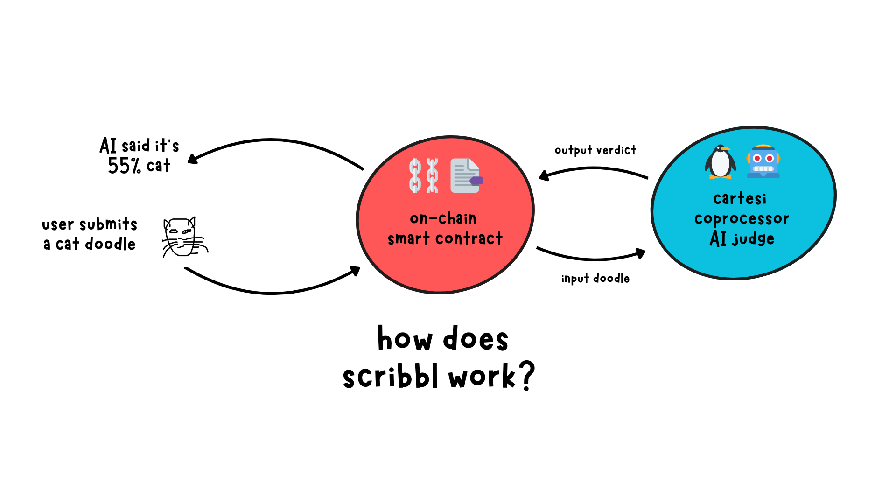

# Scribbl - An Experiment Week #3 Project

A ridiculously simple app where AI judges your hand-drawn doodles. It's a fun experiment to showcase the powers of Cartesi Coprocessor with Eigenlayer infrastructure. We use an inference model trained over the popular [QuickDraw dataset](https://github.com/googlecreativelab/quickdraw-dataset) to judge doodles.

## How does it work?

On a high level, a user submits a doodle and a theme to our on-chain smart contract - `ScribbleTaskManager`. The role of this task manager is to relay the tasks to our Cartesi Coprocessor that's running our core application logic. The backend runs the doodle over a pre-trained AI model and outputs the top predictions back to the smart contract.

## How to run it on your local machine?
To run the app, you'll need to spin up the backend and then run the UI.

### Step 1: Running the backend

- `cartesi-backend`: Navigate to this directory and follow the instructions in the [README](./cartesi-backend/README.md#running-the-backend). You'll have Coprocessor Devnet environment running in no time with our Python app code and corresponding Smart contracts deployed.

### Step 2: Running the UI

- `ui`: Navigate to this directory and follow the instructions in the [README](./ui/README.md).

